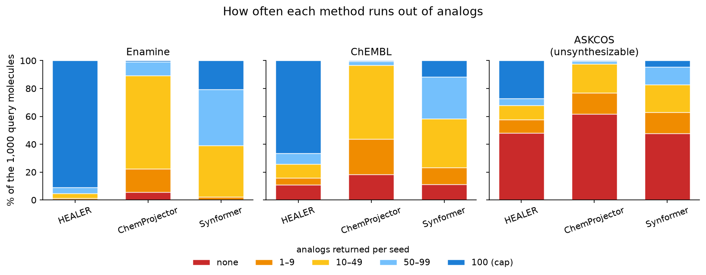
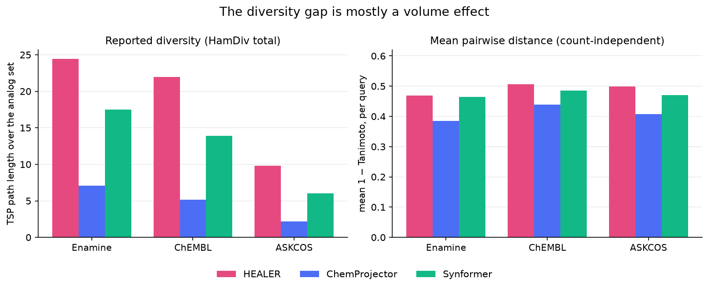

You have a hit from a screen. You want a hundred analogs of it — close enough to
keep whatever made it interesting, different enough to learn something, and
orderable before the quarter ends.

That last constraint is the one computational methods keep breaking. A molecule
that scores well and cannot be made is worse than nothing, because someone has
to spend a week finding that out.

Three recent tools take the constraint seriously by building only from reaction
templates and purchasable building blocks. Two of them — ChemProjector and
SynFormer — learn to navigate that space with a transformer. HEALER just
enumerates it. On the benchmark in the paper, the enumerator performs on par
with both.

## What it does

HEALER fragments a hit along its own retrosynthesis, matches each fragment to
commercially available building blocks, and recombines them with curated SMARTS
templates. Every analog arrives with the route that made it, because the route
is how it was built rather than something inferred afterwards.

The template library is 60 reactions, filtered from datamol's 127 down to those
with two reactants and one product. The building block libraries are Enamine
in-stock catalogues — roughly 195,000 US, 153,000 European, 291,000 combined —
preprocessed once so each block carries annotations for the reactions it can
participate in. Filtering the reactant pool for a given reaction is then a set
lookup rather than a substructure search.

Decomposition is a recursive retrosynthetic tree: cut the molecule at bonds
corresponding to the reverse of a forward template, and each cleavage yields
fragments that could recombine by a known reaction. One fragment is held as the
preserved scaffold; the others become replacement candidates. Each is scored
against the library on ECFP6 with a size-weighted Tversky similarity:

$$
s(f, b) = \left(1 - \frac{\max(0,\; n_b - n_f)}{n_b}\right) \cdot T_{0.95,\,0.05}(f, b)
$$

The $\alpha = 0.95$, $\beta = 0.05$ weighting asks how much of the fragment the
building block contains while forgiving the extra atoms it brings along. The
prefactor penalises building blocks larger than the fragment they replace, and
only those — $n_b \le n_f$ leaves the score untouched. Without it, Tversky's
tolerance for extra features lets a large building block match almost any small
fragment, and the analogs drift heavier with every round.

## Coverage

The benchmark uses three sets of 1,000 molecules: Enamine's Diversity screening
collection, lead-like bioactives from ChEMBL, and molecules a synthesis planner
flagged as practically unsynthesizable. Every method is asked for more than a
hundred unique analogs per query, runs its own deduplication, and has whatever
it returns capped at 100.

On successful enumeration rate — the fraction of inputs yielding at least one
analog — HEALER and SynFormer tie exactly: 1.00, 0.89, and 0.52 across the three
sets. ChemProjector trails at 0.97, 0.83, and 0.40. Three very different amounts
of machinery, nearly the same reach.

Producing one analog is a low bar, though. The question a chemist actually has
is whether you can fill a plate.

HEALER delivers the full hundred for 91% of Enamine queries. ChemProjector does
for 0.7%, and leaves a fifth of all seeds with fewer than ten. SynFormer sits
between. The pattern survives the move to ChEMBL with everything shifted down,
and on the unsynthesizable set all three fall together.

Since every method was asked for more than a hundred and stopped when it ran
out, a short list is not a stylistic choice. It is the method reporting that it
could not find that many distinct analogs around this particular hit. Sampling a
space and enumerating it are different in exactly this way: a sampler converges
on the modes it knows and stops finding anything new, while an enumerator keeps
going as long as fragments have compatible building blocks.

The routes stay short throughout. HEALER's analogs average 1.32 to 1.5 reaction
steps depending on the dataset — usually one forward reaction applied to the hit,
occasionally two. SynFormer runs longer, up to 1.99 steps on the unsynthesizable
set, and the extra steps show up as higher SA scores.

## What the diversity number measures

Internal diversity is reported as HamDiv, which is absolute rather than
normalised by set size. Methods that return more analogs score higher. That
sounds like a confound and mostly is not one, because failing to return the
requested hundred is itself the finding: a method that stalls at twenty has not
covered the neighbourhood, however varied those twenty are.

It is still worth knowing which of the two effects is doing the work.

Measured per molecule — mean pairwise Tanimoto distance inside each query's
analog set, which ignores how many there are — the three methods nearly
converge. HEALER runs 0.47 to 0.51 across the datasets, SynFormer 0.46 to 0.49,
ChemProjector 0.39 to 0.44.

So HEALER's analogs are not individually more exotic than SynFormer's. Its
advantage is that it can actually deliver a hundred of them. Both readings point
the same way and the second one locates the difference: this is a story about
chemical space coverage, not about one method finding stranger chemistry than
another. ChemProjector is the exception on both axes — narrower per molecule as
well as shorter overall — and the paper attributes that to training bias toward
prevalent reaction chemistries, reaching for the same transformations
repeatedly.

## The cost asymmetry

SynFormer took over a thousand GPU hours to train. HEALER's dependencies are
RDKit, NumPy, pandas, joblib, and tqdm — no PyTorch, because there is nothing to
train and nothing to run inference with. Enumeration finishes in seconds for a
given molecule on a standard laptop — hundreds of analogs in the time it takes
to load a web page.

Three practical consequences follow, and none of them show up in a table of
property scores. It deploys as a web application anyone can use from a browser
with no specialised hardware. It installs locally, which matters when the
compound data is proprietary and cannot leave the building. And the chemistry
knowledge is a JSON file: adding a reaction template extends what the tool can
generate immediately, with nothing to retrain.

That last property suggests a use the paper does not raise, and which is my
speculation rather than its claim. HEALER produces large volumes of
synthesizable molecules with explicit routes attached, on CPU, for any seed you
give it. That is precisely the training data a route-conditioned generative
model needs. A tool positioned as an alternative to SynFormer and ChemProjector
may end up being most useful as a cheap way to feed them.

## Where it breaks

Returning nothing for roughly half the unsynthesizable set is the honest
limitation. A molecule the template library cannot take apart has no
compositions, and a query with no compositions has no analogs. HEALER does not
degrade gracefully; it declines. SynFormer declines at the same rate, so this is
less a HEALER weakness than a boundary on what template-based decomposition can
reach at all.

The same constraint caps the upside. HEALER cannot propose the scaffold hop that
solves your problem if no sequence of templates reaches it from your hit. It is
good at the neighbourhood and has nothing to say about the rest of the city.
Sixty templates and a catalogue define the space exactly, which is a virtue when
you want to know what you are searching and a limit when the answer is outside
it.

Which is the trade I would make for hit expansion and would not make for de novo
design. Constrained enumeration bets that the analogs worth having sit close to
the molecule you started with, reachable by chemistry someone has already
validated. At this particular step that bet is usually right — and for now, a
well-built enumerator gets you there without the training run. I expect the
learned methods to pull ahead eventually. They have not yet, and it is worth
being precise about that rather than assuming it.

---

HEALER is `pip install mol-healer`, MIT licensed, with a web server at
[healer.mml.unc.edu](https://healer.mml.unc.edu) and source at
[github.com/eneskelestemur/healer](https://github.com/eneskelestemur/healer).
The preprint is on
[ChemRxiv](https://doi.org/10.26434/chemrxiv.15003011/v1).
